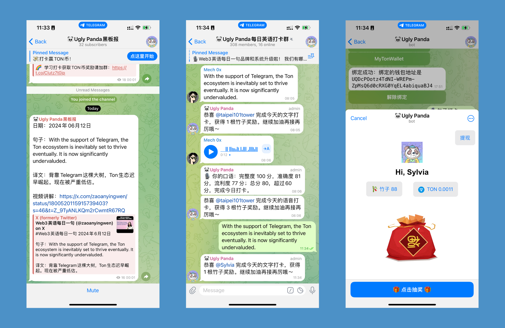

<a href='https://t.me/Web3DailyEnglish'>
</img>
</a>
  

  
[?style=for-the-badge>)](https://t.me/Web3DailyEnglish)
[?style=for-the-badge>)](https://t.me/Web3EngBot)

---

# Vision
Ugly Panda is a learn-to-earn TMA for learning English, designed for the vast audience of over 1.5 billion potential Web3 users in the Chinese-speaking regions. By engaging with daily original English content, users can gain points and enter raffles to win TON and other token rewards from collaborating partners.Ugly Panda will produce original English learning videos for collaborative partners, serving as a prime gateway for projects aiming to reach 1.5 billion Chinese-speaking users.

# Usage

Join the Telegram channel to learn Web3 English : https://t.me/Web3DailyEnglish

# Problems
The entire Chinese-speaking region has over 1.5 billion potential Web3 users; however, the vast majority of them are not proficient in English, which prevents them from quickly and thoroughly understanding and immersing themselves in the exciting world of Web3.Proficiency in English specific to the Web3 sector is a fundamental requirement.

# Key Features
1. Create a new, authentic original Web3 English sentence every day, with accompanying tutorial videos recorded by experienced professional English teachers;
2. Users earn points by repeating the daily English sentence;
3. Spend a certain amount of points to participate in a lottery to win a certain number of Tons;
4. When users withdraw Tons, they naturally learn how to use a cryptocurrency wallet, thus converting Telegram users into TON users.

# Roadmap

### Implementation of a Point Reward System
Objective: To increase user retention and daily activity on the Ugly Panda platform.  
Details:  
- Launch Phase: Design and implement a tier-based point system where users can earn points for daily logins, posting content, and engaging with other users.
- Reward Mechanism: Introduce various incentives such as unlocking special features, exclusive content, or discounts on merchandise as users accumulate more points.
- Purpose: This system aims to encourage users to interact more frequently and deeply with the platform, thus enhancing overall engagement and retention.

### User Referral Program
Objective: To attract more users to Ugly Panda and expand our community.  
Details:  
- Referral Incentives: Develop a referral program that rewards existing users with points, discounts, or exclusive content for inviting new users to the platform.
- Tracking and Rewards: Implement a tracking system to ensure referrers receive their rewards as new invitees sign up and engage on the platform.
- Purpose: The referral program is intended to leverage the existing user base to organically grow the platform’s user base, reducing dependence on conventional advertising methods.

### User Loyalty Program with Partner Projects
Objective: To enhance user loyalty and enrich the Ugly Panda ecosystem.  
Details:  
- Collaboration with Partners: Invite potential partners to airdrop their NFTs or tokens to active Ugly Panda users.
- Exclusive Rewards: Set criteria for eligibility based on user activity levels, ensuring that the most engaged users are rewarded.
- Purpose: This program aims to provide additional value to our users and strengthen community bonds, encouraging long-term engagement and loyalty.

These strategic initiatives are designed to foster a vibrant, engaged, and steadily growing community on the Ugly Panda platform. Implementing these programs will not only enhance the user experience but also boost the platform's overall health and sustainability.

# License
Ugly-Panda is under the Apache 2.0 license. See the [LICENSE](./LICENSE) file for details.

# Contact Us
- Telegram Bot: [@Web3EngBot](https://t.me/Web3EngBot)
- Dev: [@tbag127](https://t.me/tbag127)
- Email: barmancapital127@gmail.com
